# Synthetic 360° Space-Object Dataset (Equirectangular)

A synthetic dataset of space objects rendered as 360° equirectangular (ERP) panoramas, for training omnidirectional perception models — semantic segmentation, depth estimation, classification, and 6-DoF pose. It is modeled on perspective spacecraft datasets (e.g. SPEED, URSO, and the Blender-based NCSTP) but extended to the equirectangular domain for a 360°/omnidirectional sensor application.


## At a glance

- **Total images:** 49,998
- **Classes:** 13
- **Resolution:** 1024×512
- **Renderer:** OPTIX (True), Blender 5.1.2
- **Distinct models:** 208 across 13 classes
- **Depth coverage:** 49,998/49,998

## How to use

Each frame ships **RGB** (1024×512 equirectangular), a **semantic mask** (pixel class IDs 0–13; 0 = background), a **depth map** (32-bit OpenEXR), and a **metadata JSON** with the subject class, orientation quaternion, and spherical position. Use the provided train/val/test split (≈80/10/10, stratified by class).

- **Classification** — predict the subject class from the RGB panorama.
- **Segmentation** — predict per-pixel labels (14 classes); use class-weighted or focal loss because planets/moons also appear as backdrops.
- **Depth** — predict log-depth on foreground pixels; evaluate scale-invariantly (absolute metric depth is ill-posed in space).
- **Pose** — bearing is readable from image position; attitude is an open challenge (see baselines below).

Treat inputs as ordinary 2-D images for baselines. Augment with **horizontal roll** (longitude rotation); **do not** vertically flip — that breaks pole geometry.

## How to use this code

This repo ships baseline training scripts and documentation tools. Run everything from the **repository root**.

### Setup

```bash
pip install -r requirements.txt
# Install a CUDA build of torch matching your GPU driver if training on GPU.
```

Point all scripts at your local dataset root (not included here). Expected layout:

```
<dataset_root>/
├── image/<class>/<id>.png
├── mask/<class>/<id>.png
├── depth/<class>/<id>.exr
├── meta/<class>/<id>.json
└── splits.json          # created by split_dataset.py
```

### Workflow

**1. Create a reproducible split** (≈80/10/10, stratified by class):

```bash
python scripts/split_dataset.py /path/to/dataset_root
```

**2. Train baselines** (examples — set `CUDA_VISIBLE_DEVICES` as needed):

```bash
python scripts/train_classify.py /path/to/dataset_root --epochs 8 --arch resnet50
python scripts/train_segment.py  /path/to/dataset_root --epochs 20 --encoder resnet34
python scripts/train_depth.py    /path/to/dataset_root --epochs 20 --encoder resnet34
python scripts/train_pose.py     /path/to/dataset_root --epochs 20 --arch resnet50
```

Checkpoints and curves are written to `runs/<task>/`.

**3. Regenerate dataset docs** (after updating `stats.json`):

```bash
python make_dataset_docs.py
```

**4. Regenerate figures**:

```bash
python scripts/make_all_figures.py          # stats charts -> figures_candidates/
python scripts/make_paper_figures.py --root /path/to/dataset_root --ckpt runs/classify/best.pt
```

**5. Optional utilities**:

| Script | Purpose |
|---|---|
| `scripts/subtypes.py` | Per-class 3-D model breakdown → `subtypes.json` |
| `scripts/gather_gt.py` | Bundle hand-picked candidate frames into `candidates_gt/` |
| `scripts/classify_candidates.py` | Classify candidates → `outputs/classify_candidates.csv` |
| `scripts/evaluate_candidates.py` | Segmentation + depth eval → `outputs/eval_per_frame.csv` |
| `scripts/classify_testset.py` | Full test-split classification metrics |

### Repository layout

```
├── README.md              # Dataset documentation (this file)
├── stats.json             # Dataset statistics (feeds make_dataset_docs.py)
├── make_dataset_docs.py   # Regenerate README from stats.json
├── requirements.txt
├── figures/               # Documentation figures
├── scripts/               # Training, evaluation, and figure scripts
└── outputs/               # Evaluation CSVs and other small results
```


Each frame is rendered in Blender (Cycles, GPU/OptiX) through a Python (bpy) pipeline. The camera is a panoramic equirectangular camera capturing the full sphere. Every frame places one labeled subject in a fully random 3-D orientation (logged as a quaternion) at a random position on the sphere. Backgrounds mix a procedural starfield of varied density, a randomly chosen planet or moon backdrop (Earth, Mars, Jupiter, Saturn, Venus, Moon), and an occasional pure-black deep-space frame. Lighting uses a sun aimed at the subject plus fill and rim lights; backdrops receive a dedicated sun so their camera-facing side is lit. Depth is written through the compositor as a single-layer 32-bit OpenEXR. Cubesats are partly procedurally generated (random 1U/2U/3U/6U bodies, deployable solar wings, antennas) to compensate for the small number of real cubesat models.

## Assets & attribution

3-D models are from NASA's 3D Resources collection; planet and moon surfaces use NASA imagery. Procedural generators (cubesat, asteroid, textured sphere) supplement the real models. NASA-produced media is generally free to use with attribution and without implying NASA endorsement, but some items are third-party and carry their own terms — verify the license of each model against NASA's official media-usage guidelines and the NASA 3D Resources terms before redistribution, and cite NASA as the source of the underlying 3-D models.

## Classes & label palette

| Class | Subject frames | Models | RGB | Hex |
|---|--:|--:|---|---|
| earth_obs_satellite | 3,846 | 51 | (220, 50, 50) | #dc3232 |
| space_telescope | 3,846 | 26 | (50, 200, 80) | #32c850 |
| space_station | 3,846 | 10 | (50, 90, 220) | #325adc |
| deep_space_probe | 3,846 | 32 | (220, 200, 50) | #dcc832 |
| mars_mission | 3,846 | 17 | (200, 100, 30) | #c8641e |
| comm_satellite | 3,846 | 8 | (160, 60, 200) | #a03cc8 |
| cubesat | 3,846 | 4 | (60, 200, 200) | #3cc8c8 |
| astronaut_eva | 3,846 | 14 | (240, 130, 200) | #f082c8 |
| solar_heliophysics | 3,846 | 17 | (250, 160, 40) | #faa028 |
| rocket_launch_vehicle | 3,846 | 25 | (120, 80, 220) | #7850dc |
| planet | 3,846 | 1 | (30, 120, 255) | #1e78ff |
| moon | 3,846 | 1 | (190, 190, 190) | #bebebe |
| asteroid | 3,846 | 2 | (120, 100, 80) | #786450 |

_Background (class 0) is black (0,0,0)._

## Distribution & balance

- Earth/planet backdrop: 25.4%
- Near-pole: 6.1%
- Pure-black background: 0.0%
- >1 labeled object: 25.4%

## Figures

**Subject frames per class. A flat profile confirms class balance.**

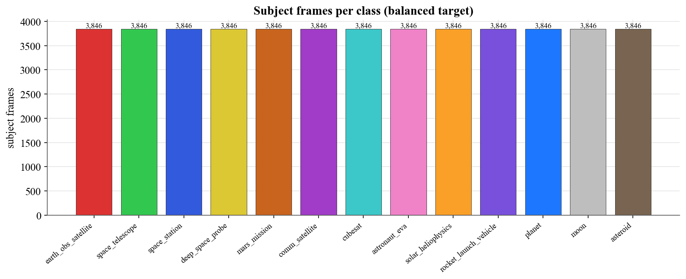

**Total occurrences per class. Planet/moon exceed their subject counts because they also appear as backdrops — relevant for per-pixel class weighting.**

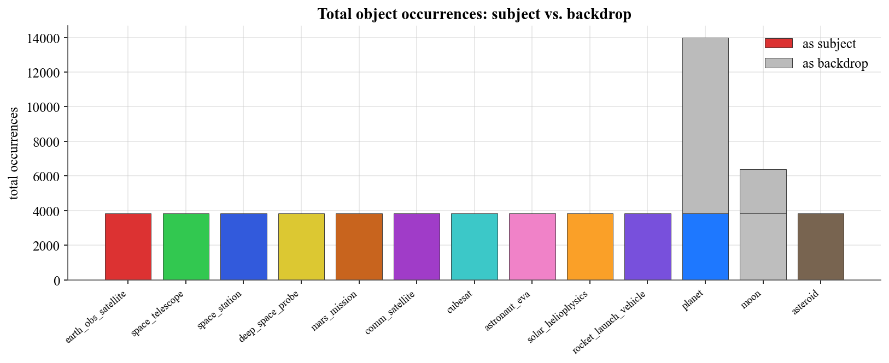

**Distinct underlying 3-D models per class. Low values (e.g. comm_satellite) indicate limited shape variety.**

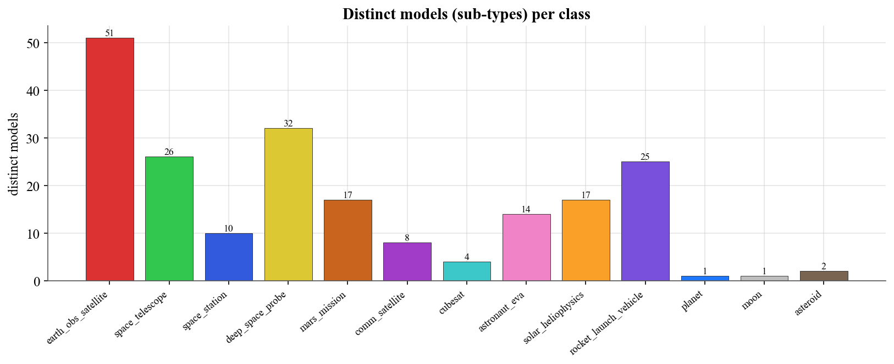

**Share of frames carrying each attribute flag.**

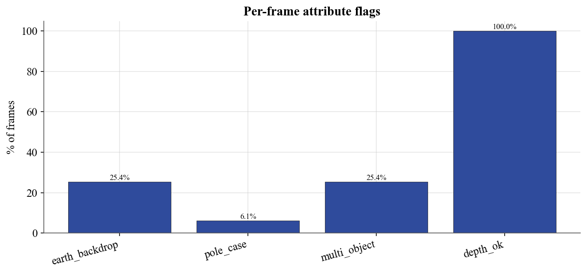

**Number of labeled objects per frame (1 = subject only, 2 = subject + backdrop).**

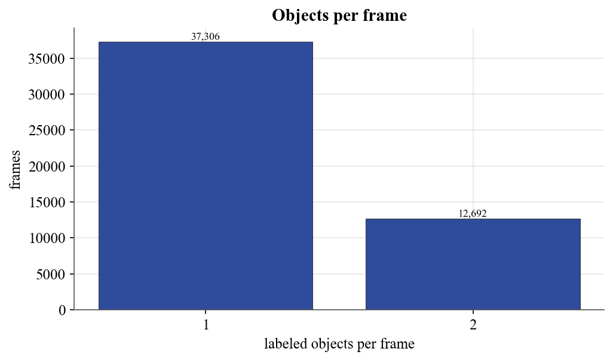

**Apparent angular size of the subject across the dataset.**

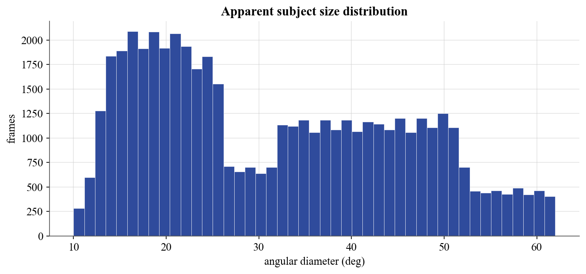

**Per-class apparent size. Celestial classes appear larger than craft.**

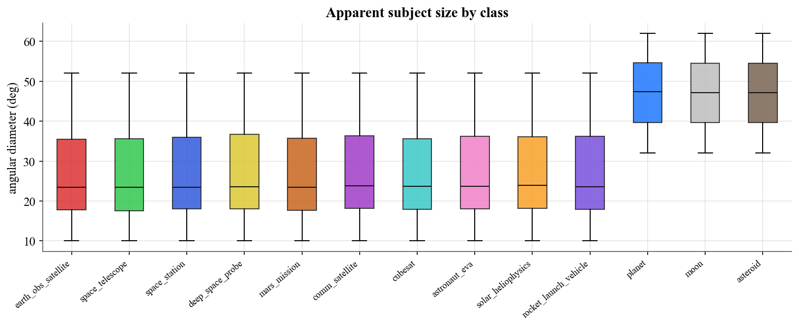

**Distance from camera to subject.**

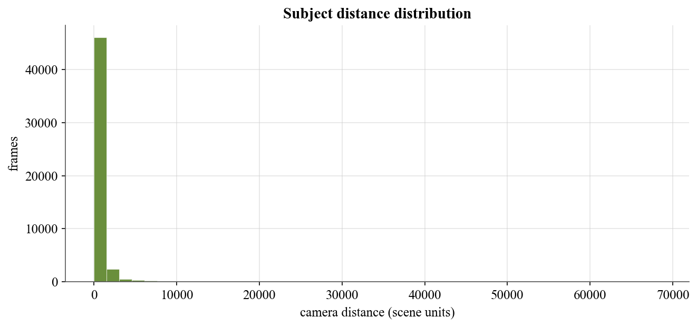

**Subject azimuth distribution (flat = even 360° coverage).**

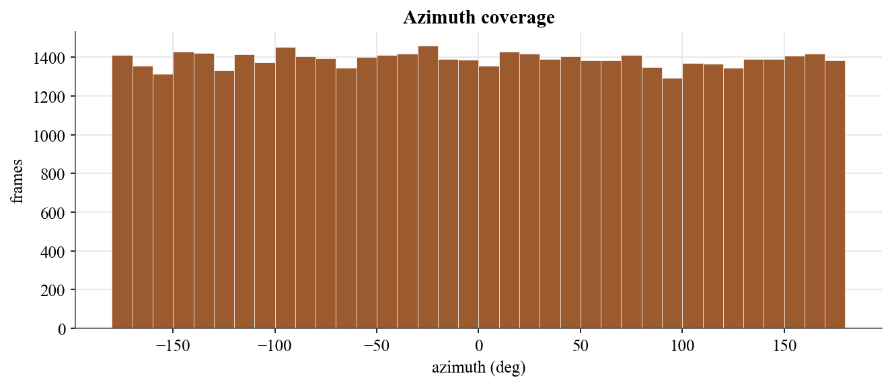

**Subject elevation distribution; the tails are the deliberate near-pole frames.**

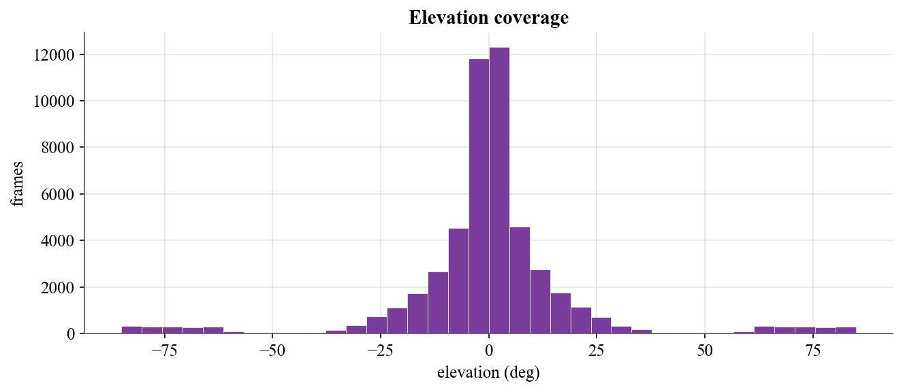

**Joint azimuth–elevation density. Uniform fill = good spherical coverage.**

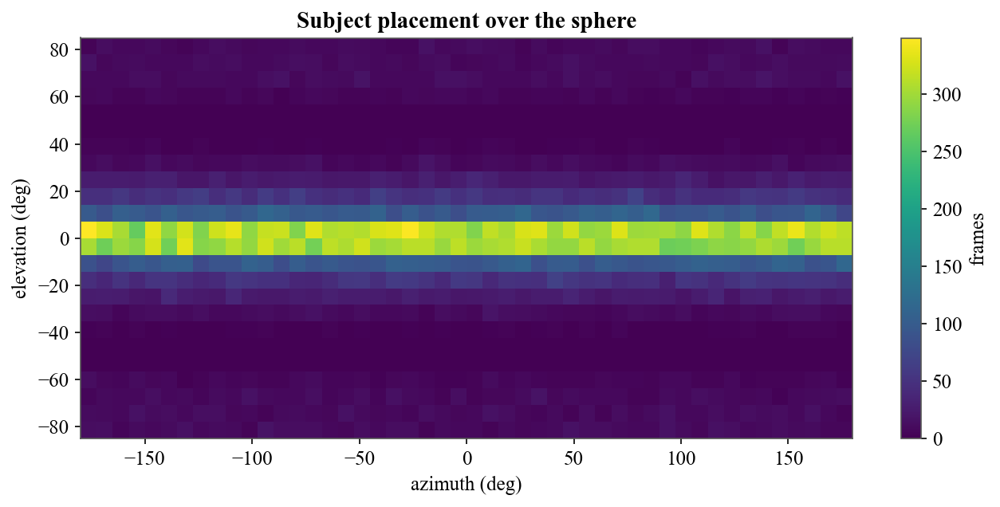

**Which planet/moon textures appear as backdrops.**

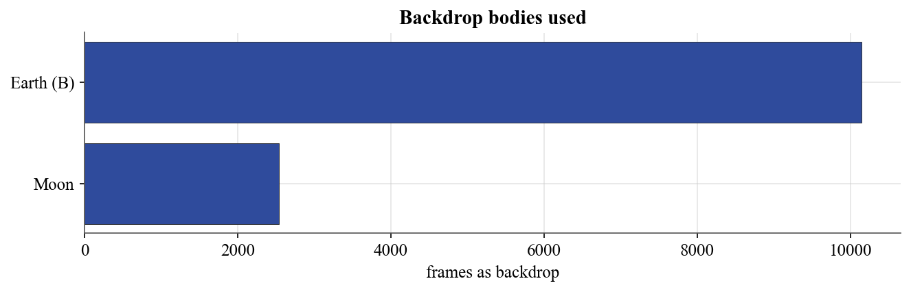

**Per-model frame counts within planet.**

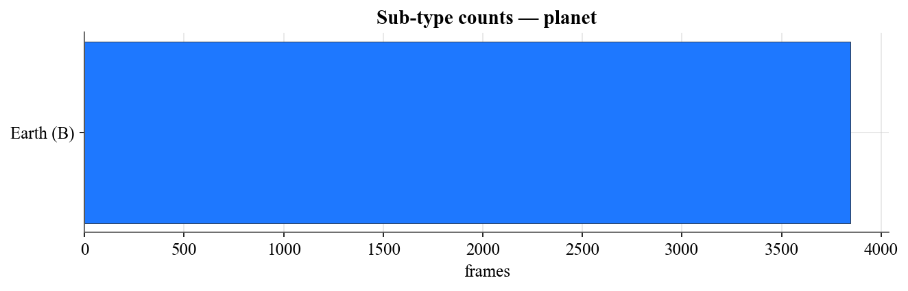

**Per-model frame counts within moon.**

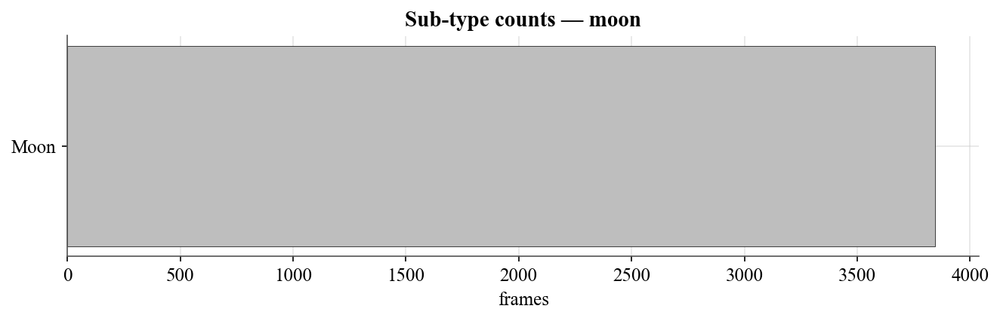

**Per-model frame counts within asteroid.**

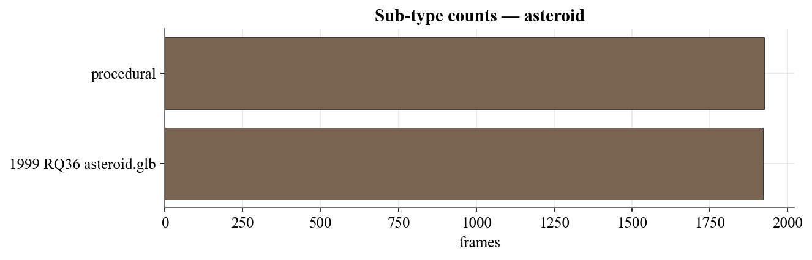

## Comparison with existing space datasets

Public spacecraft-vision datasets are overwhelmingly perspective (pinhole), and most target a single spacecraft for pose estimation (SPEED, SPEED+, URSO, SwissCube); SPARK and NCSTP are the main multi-class sets, the latter being the closest precedent — a large-scale, Blender-rendered, multitask synthetic benchmark for detection, recognition, and component segmentation. This dataset follows a similar synthetic-Blender philosophy but differs primarily in projection — it is equirectangular 360°, intended for omnidirectional sensors — and provides per-object semantic segmentation, depth, and 6-DoF pose rather than perspective component-part masks. Unlike SPEED and SPEED+, it contains no real or hardware-in-the-loop imagery; it is purely synthetic, which is its main trade-off against those benchmarks.

| Dataset | Year | Group (authors) | Projection | Targets / classes | Images | Ground truth | Task |
|---|---|---|---|---|---|---|---|
| SPEED | 2019 | Stanford SLAB & ESA ACT (Sharma, Park, D'Amico) | Perspective | 1 (Tango) | 15,300 (15,000 synthetic + 300 real) | RGB, pose | Pose estimation |
| SPEED+ | 2021 | Stanford SLAB & ESA ACT (Park, Märtens, Lecuyer, Izzo, D'Amico) | Perspective | 1 (Tango) | 59,960 synthetic + 9,531 HIL real | RGB, pose, masks | Pose / domain gap |
| URSO | 2020 | Surrey Space Centre (Proença, Gao) | Perspective | 2 (Soyuz, Dragon) | ~15,000 (5,000 per set) | RGB, depth, pose | Pose estimation |
| SwissCube | 2021 | EPFL CVLab (Hu, Speierer, Jakob, Fua, Salzmann) | Perspective | 1 (SwissCube) | 50,000 (40k/10k) | RGB, 6-DoF pose | Wide-depth-range 6D pose |
| SPARK | 2021 | Univ. of Luxembourg SnT & LMO (Musallam et al.) | Perspective | 11 classes (10 spacecraft + 1 debris) | ~150,000 RGB + 150,000 depth | RGB, depth, class, bbox | Classification & detection |
| NCSTP | 2025 | Liu, Bian, Nie, Chen, Yang (Scientific Data) | Perspective | 26 models (16 satellites, 6 debris, 4 rocks); 4 component classes | 200,000 | RGB, detection boxes, recognition labels, component masks | Detection, recognition, component segmentation |
| **This dataset** | 2026 | — | Equirectangular 360° | 13 classes (~208 NASA models) | 49,998 | RGB, semantic mask, depth (EXR), class, 6-DoF pose | Segmentation, depth, classification, pose |

**References**

- S. Sharma, T. H. Park, S. D'Amico. Spacecraft Pose Estimation Dataset (SPEED). Stanford Digital Repository / ESA Kelvins SPEC2019, 2019.
- T. H. Park, M. Märtens, G. Lecuyer, D. Izzo, S. D'Amico. SPEED+: Next-Generation Dataset for Spacecraft Pose Estimation across Domain Gap. IEEE Aerospace Conference, 2022.
- P. F. Proença, Y. Gao. Deep Learning for Spacecraft Pose Estimation from Photorealistic Rendering (URSO). IEEE ICRA, 2020.
- Y. Hu, S. Speierer, W. Jakob, P. Fua, M. Salzmann. Wide-Depth-Range 6D Object Pose Estimation in Space (SwissCube). IEEE/CVF CVPR, 2021.
- M. A. Musallam, K. Al Ismaeil, O. Oyedotun, M. D. Perez, M. Poucet, D. Aouada. SPARK: SPAcecraft Recognition leveraging Knowledge of Space Environment. IEEE ICIP Grand Challenge, 2021.
- Y. Liu, C. Bian, H. Nie, S. Chen, Z. Yang. A Large-Scale Synthetic Benchmark Dataset for Non-Cooperative Space Target Perception (NCSTP). Scientific Data 12, 1780, 2025. DOI: 10.1038/s41597-025-06056-8.

## Baseline results

Reference baselines on the dataset's own train/val/test split (≈80/10/10, stratified by class), using **standard models — not ERP-specific architectures** — to establish where the dataset stands and to leave clear headroom. Trained on a single RTX 3060. Inputs are treated as ordinary 2-D images; the ERP-valid horizontal-roll augmentation (a longitude rotation of the sphere) is used, while vertical flips are avoided since they would break the poles.

### Classification (13 classes)

ResNet-50, ImageNet-pretrained, fine-tuned. Test top-1 accuracy:

| Input | Epochs | Test top-1 |
|---|--:|--:|
| 256×512 | 8 | 86.4% |
| 384×768 | 12 | **88.1%** |

Per-class accuracy (384×768 model):

| Class | Acc | Class | Acc |
|---|--:|---|--:|
| planet | 1.000 | comm_satellite | 0.901 |
| moon | 1.000 | space_station | 0.883 |
| asteroid | 1.000 | astronaut_eva | 0.878 |
| cubesat | 0.912 | rocket_launch_vehicle | 0.873 |
| solar_heliophysics | 0.847 | mars_mission | 0.839 |
| deep_space_probe | 0.797 | earth_obs_satellite | 0.766 |
| space_telescope | 0.758 | | |

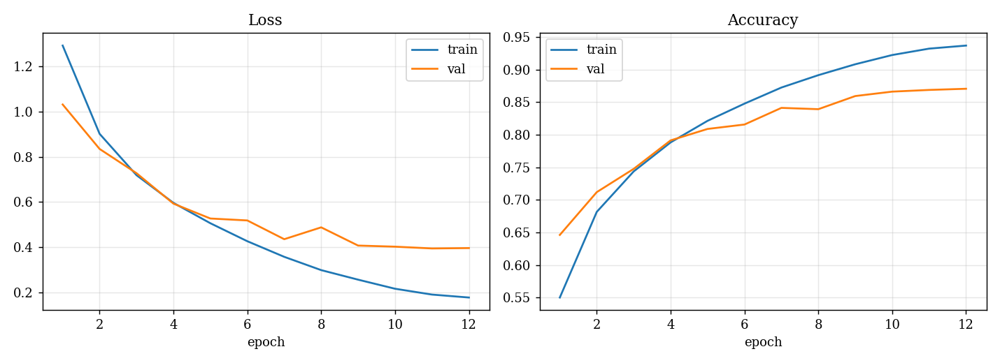

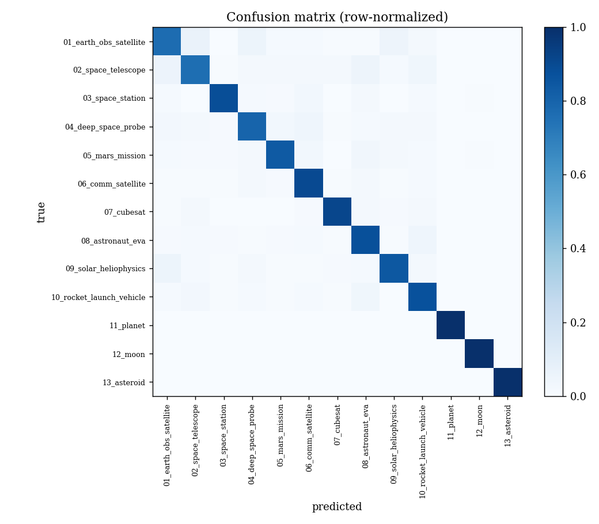

Visually distinct classes (celestial bodies, cubesat, comm) are essentially solved. The function-defined satellite classes — space_telescope, earth_obs_satellite, deep_space_probe, solar_heliophysics — form a confusion cluster because they share a "bus + solar panels + instrument" appearance. Higher input resolution improved precisely these classes (~+3 points each), confirming small-object detail as a contributing factor.

### Semantic segmentation (14 classes: background + 13)

U-Net with an ImageNet-pretrained ResNet-34 encoder, trained at native 512×1024 for 20 epochs with class-weighted cross-entropy + Dice loss to handle the background/planet pixel imbalance.

**Test mIoU 0.628 · foreground mIoU 0.600**

Per-class IoU:

| Class | IoU | Class | IoU |
|---|--:|---|--:|
| background | 0.995 | comm_satellite | 0.657 |
| asteroid | 0.830 | astronaut_eva | 0.607 |
| planet | 0.828 | space_station | 0.581 |
| moon | 0.814 | rocket_launch_vehicle | 0.555 |
| cubesat | 0.769 | mars_mission | 0.542 |
| deep_space_probe | 0.453 | solar_heliophysics | 0.422 |
| earth_obs_satellite | 0.393 | space_telescope | 0.345 |

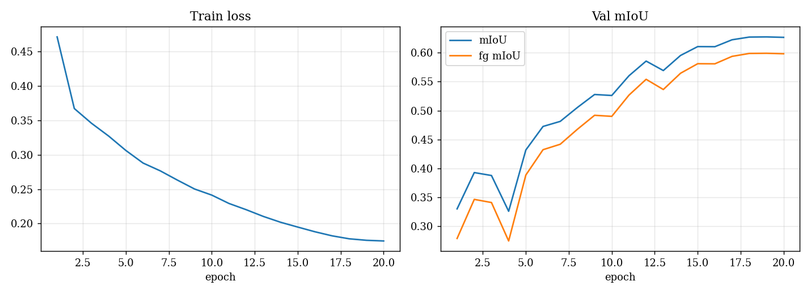

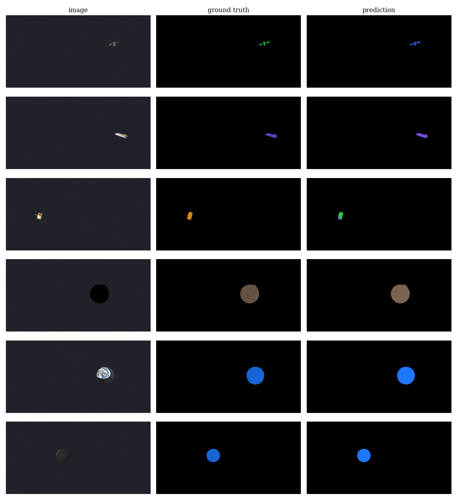

Large or distinctly shaped objects segment well; the lowest IoU again falls on space_telescope and earth_obs_satellite — the same look-alike cluster, so the dataset's difficulty is consistent across tasks. The unlit limbs of planets and moons are sometimes under-segmented, since they are near-black and blend into space.

### Monocular depth estimation (scale-invariant)

Absolute metric depth is ill-posed for isolated objects in space (no scale cues), so depth is benchmarked **scale-invariantly**: a U-Net with an ImageNet-pretrained ResNet-34 encoder predicts log-depth, trained with a scale-invariant (SILog) loss. The "infinite" background is masked out, and metrics are computed on foreground (object) pixels after per-image log-scale alignment — standard practice for monocular depth (Eigen et al., 2014; MiDaS / DPT).

**Test AbsRel 0.067 · δ<1.25 0.957**  _(RMSE ≈ 50 scene units, but RMSE is dominated by far backdrop pixels and is the less reliable metric here.)_

The model recovers genuine relative 3-D structure rather than flat blobs: spheres (planets, moons) show the correct centre-near / limb-far radial gradient, and elongated craft show the along-axis gradient induced by their orientation. Depth is the strongest task by relative accuracy and converges within a few epochs — relative depth from shading and silhouette is highly learnable here, even though absolute depth is not. Large textured bodies occasionally leak surface texture into the predicted depth, and the smallest craft give correct silhouettes with little internal gradient.

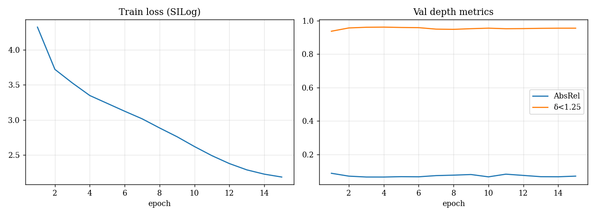

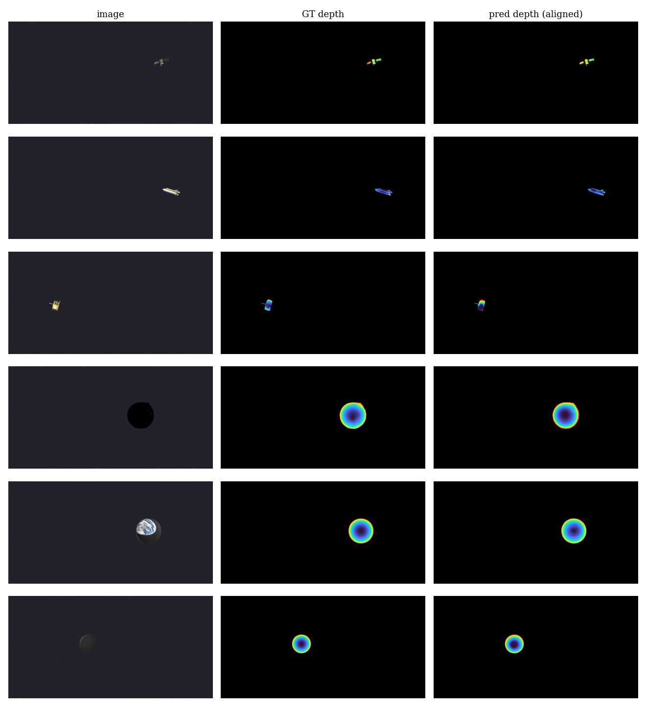

### 6-DoF pose: bearing, range, and an open attitude challenge

The dataset provides full 6-DoF pose ground truth per object (orientation quaternion + spherical position). The three components differ sharply in difficulty:

- **Bearing (azimuth/elevation, 2 DoF)** is directly observable — in an equirectangular panorama the object's image position *is* its bearing, so it is recovered essentially for free.
- **Range (distance, 1 DoF)** is scale-ambiguous for isolated objects (the same limitation characterized in the depth task) and is not recoverable in absolute terms from a single view.
- **Attitude (orientation, 3 DoF)** is an **open challenge**. A standard baseline — ResNet-50 regressing the orientation quaternion from a mask-cropped, aspect-preserved object patch, with bearing supplied as auxiliary input, trained with a double-cover quaternion loss — does not exceed chance (test median geodesic error ≈ 130°, acc@30° ≈ 0.01; chance ≈ 120°). Training loss falls while validation stays at chance: the model memorizes training examples but extracts no generalizable orientation signal. We attribute this to small object scale, pervasive symmetry and feature-poverty, and high intra-class shape diversity (208 models). Single-view omnidirectional attitude estimation thus remains an open problem this dataset enables future work to tackle.

_Baselines use standard 2-D models. Distortion-aware (spherical/equirectangular) architectures, the small-object regime, and the look-alike satellite cluster are open directions for improvement; **single-view attitude estimation remains an open challenge**._

## Known limitations

- Thin model diversity in a few classes (e.g. comm_satellite, space_station): frame counts are balanced, but the number of distinct underlying models is small, so shape variety is limited there. Cubesats are supplemented procedurally.
- Planet and moon are over-represented at the pixel level because they appear as backdrops as well as subjects. Frame-level classification is balanced; for per-pixel segmentation use class-weighted or focal loss.
- Some sub-types are over-represented within a class due to occasional model-import fall-through. Negligible for class-level tasks; relevant only if sub-types are used as labels.
- ERP distortion near the poles and the wrap-around seam is present by design — it reflects what a real 360° sensor sees and is part of the intended challenge.
- Lighting is deliberately softened (fill + rim + faint stars) for trainability; real space imagery has harsher contrast and often no visible stars.
